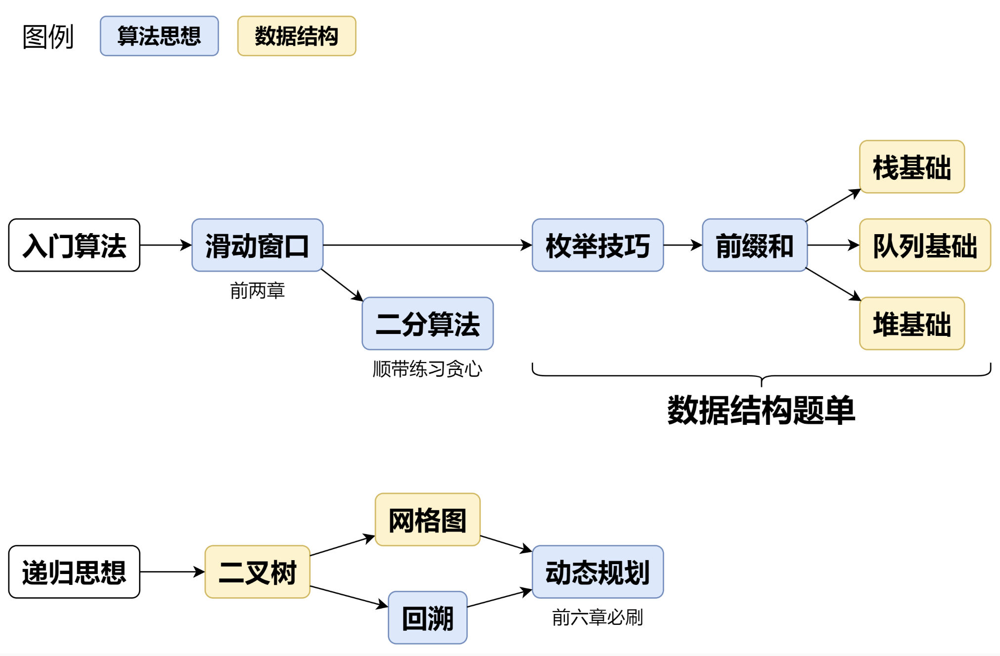

## 在线网站

> 全球：https://leetcode.com/
>
> 国内：https://leetcode.cn/

## 语言选择

主流 Py 和 Java

Py 更灵活，Java 更工程

## 视频资源

印度老哥

灵茶山艾府

## 书籍资源

Hello 算法

剑指 Offer

编程珠玑

## 刷题资源

1.代码随想录。个人已经多刷了很多遍，建议初学者从这个入手，优点是将题目按照类别和难度排序，并且有详细的讲解。最重要的是，卡哥同步还拍了对应的讲解视频，如果看不懂文字版还能去看视频。有在线网站，电子书PDF，纸质书。

2.labuladong算法小抄。这个也很经典，和代码随想录类似，GitHub上的star数量都超过几十K了，可见这份资料的广受好评。同样也是有电子书，在线网址，纸质书，甚至有刷题插件。

3.Krahets的《Hello 算法》地址为http://hello-algo.com。想必刷过剑指Offer的同学对那个头像是路飞的男人不陌生，有人甚至说是他支撑着自己将剑指offer刷完的。我也是相见恨晚。这位学长做的网站不是刷题目录，而是主打一个讲解每种数据结构和算法的原理，贴心地将几乎所有语言可执行代码都写了出来。可以自己动手跑一遍。

## 题单

推荐以下 LeetCode 题单：

1. [Krahets 笔面试精选 88 题](https://leetcode.cn/studyplan/selected-coding-interview/)：从“剑指 Offer”和“热题 100”精选出的 88 道高频算法笔试题，适合初学者入门。
2. [图解算法数据结构](https://leetcode-cn.com/leetbook/detail/illustration-of-algorithm/)（[Interview-75](https://leetcode.cn/studyplan/coding-interviews/)）：题目更贴近实际应用，相较于“剑指 Offer”难度有所增加。
3. [LeetCode 热题 100](https://leetcode.cn/studyplan/top-100-liked/)：力扣用户最喜爱的 100 道题。
4. [面试经典 150 题](https://leetcode.cn/studyplan/top-interview-150/)：150 道经典面试力扣题。
5. [LeetCode-75](https://leetcode.cn/studyplan/leetcode-75/)：精选 75 道面试核心题目。

## 刷题思路

### A 专题训练

按照专题刷题，而不是随机刷题。同一个专题下的题目，套路是一样的，刷题效率杠杠滴~

螺旋上升式学习：先完成 1700 难度分以下的题目。把各个知识点的基础题刷一遍，再刷更难的题目。

完整题单
滑动窗口与双指针（定长/不定长/单序列/双序列/三指针/分组循环）
二分算法（二分答案/最小化最大值/最大化最小值/第K小）
单调栈（基础/矩形面积/贡献法/最小字典序）
网格图（DFS/BFS/综合应用）
位运算（基础/性质/拆位/试填/恒等式/思维）
图论算法（DFS/BFS/拓扑排序/基环树/最短路/最小生成树/网络流）
动态规划（入门/背包/划分/状态机/区间/状压/数位/数据结构优化/树形/博弈/概率期望）
常用数据结构（前缀和/差分/栈/队列/堆/字典树/并查集/树状数组/线段树）
数学算法（数论/组合/概率期望/博弈/计算几何/随机算法）
贪心与思维（基本贪心策略/反悔/区间/字典序/数学/思维/脑筋急转弯/构造）
链表、二叉树与回溯（前后指针/快慢指针/DFS/BFS/直径/LCA/一般树）
字符串（KMP/Z函数/Manacher/字符串哈希/AC自动机/后缀数组/子序列自动机）
对于动态规划，至少要做 100 道才算入门。

优点：按照题单专题刷，一个套路可以解决多个题目，刷题效率高。此外，做同一个专题下的题目，相当于在从不同的角度去观察、思考同一个算法，这能让你更加深刻地理解算法的本质。

缺点：提前知道题目类型，跳过了一些思考步骤。但比赛/笔试是不会告诉你这题是什么类型的，把 DP 想成贪心的大有人在。可以结合下面的方法 B，锻炼自己判断题目类型的能力。

### B 随机训练

与方法 A 互补，随机刷题。

打开 难度练习。
在设置中关闭算法标签。
选择适合自己的难度范围。
优点：做题时不知道题目类型，可以增强实战能力；查漏补缺，检验自己的学习成果。

缺点：知识点有些零散，不如题单那么系统。

### C 突击训练

Hot100

## 刷题误区

1. 刷题看数量不看质量
   这是新手最容易犯的错误，很多人刷题总是只看数量，以为刷的多就行，实际上质量比数量更重要！那什么叫高质量刷题呢？这里举几个例子(1) [4. 寻找两个正序数组的中位数](https://leetcode.cn/problems/median-of-two-sorted-arrays/) 这道题很多萌新其实连题目要求都没看懂，嚷嚷两句简单就过了，实际上这题算是个“君子游戏”，其中O(logN)的方法我到现在都不觉得容易。(2) [53. 最大子数组和](https://leetcode.cn/problems/maximum-subarray/) 题目本身不难，但如果能再进一步，完成题目的进阶要求的话，就有望完成周赛399 T4，一道接近2700分的难题。(3)[300. 最长递增子序列](https://leetcode.cn/problems/longest-increasing-subsequence/) 这道题的方法包括A、O(N2)的动态规划，B、O(NlogN)的贪心加二分查找，假如做题是打怪，学会方法A能获得10点经验值，那么方法B则相当于50点经验值！也就是说，**如果你高质量的刷1题，胜过低质量的刷3道甚至5道题**！当然，值得高质量刷的题远不止我提到的，想要高质量的刷需要耐心和积累。
2. 刷题追求所谓的击败100%
   LeetCode上做完题一般会告诉你代码运行的时间和空间情况，并附上一个击败xx%的数字，不少人会盲目的追求刷上一个高数字并把此作为衡量代码好坏的一个标准，实际上绝大多数高水平算法选手都不把这个当回事。而对于新手，这个数字**没有任何参考意义**！算法学习者真正要做的是能**正确分析自己代码的时空复杂度**（时间和空间都要分析）。（PS：根据我个人观察，如果一篇题解写自己击败了100%，80%的情况下这篇题解会是篇垃圾题解）
3. 追求所谓的一行流
   部分新人不时陷入所谓一行两行解决问题炫技。不能说一行流两行流没技术含量，但是对于算法学习而言，所谓一行流两行流是没有价值的。新手要做的是把代码写的简洁，能去掉冗余就够了。过于简短的代码，不仅对算法学习没有裨益，在实际业务中更是由于没有可读性可以直接划为垃圾。更何况很多所谓一行代码实际上以暴力的手段代替掉有深度的算法（例如排序里，冒泡排序比快排、堆排和归并排序简短得多，但从算法角度，冒泡排序价值是最低的）。

关于1，LIS的例子很好，nlogn做法没见过不太容易想到，但这对于面试已经几乎是硬性要求，最好能领悟到这个贪心做法的妙处，而不是死记代码。对于53题这个经典DP，大多数人会基础做法就够了，那个进阶对LC而言要求太高了。再补充几个非常经典的多种方法都该掌握的：32（栈模拟，DP，贪心），42（暴力，单调栈，双指针），62（DP，组合数学），206（迭代，递归，尾递归），253（优先队列，差分数组）（没会员去2406，一样的题），264（优先队列，DP）。

关于2，所谓的100%几乎都是过拟合，一旦增加case往往就不再100%（甚至直接炸掉，488被专业叉人的大佬交了一堆数据，当年的前排全军覆没），做题最重要的是正确性和复杂度，时间有限没必要纠结一些奇怪的东西。

关于3，希望所有新手能明白，这种代码整活意义大于实际意义，【不应该】刻意模仿，面试这样做很有可能回家等通知+人才库，因为这和工程代码的原则背道而驰。

我也想补充自己的一点经验，可能会反很多人的直觉，但是真的很重要。那就是遇见题目不要死磕，不要觉得这道题目很难，我花个好几天死磕把他磕出来了就证明我有多厉害了。事实上，就算磕出来了，水平也不会有多大的提升，不如那几天多写点其它题。因为你掌握的知识点和思维技巧依然没有太多的变化，同时最重要的就是这样会消磨你的热情和勇气，学习最重要的是兴趣！

成长需要时间，很多不理解的题换个时间就会做了。很多知识点可能过几年才能真正理解。放过现在的自己，也是为了成为未来更好的自己。

确实，多做其他的题目，扩展知识面，再回来看之前死磕的难题。 完全就是信息差导致的

若是埋头苦干久了也做不出来，出门走几圈再做不迟。人的思维是有惯性的，隔了一段时间，可能就会有新思路。

对初学者刷题的一些建议：

1. 建议每日刷 2～3 题。若能轻松完成，可以尝试增加至 5～8 题。
2. 刷题的质量比数量更加重要。请确保你真正理解了每个题目的解法及背后的算法原理。
3. 建议你按照题单目录的顺序做题。如果感觉一道题很难，可以先跳过，后续再攻克。
4. 题目通常有不止一种解法，请你注意比较和探讨各种方法的特点和适用情况。
5. 如果你发现自己遗忘了题目解法，不必灰心；我们通常需要复习三次以上，才能真正掌握一个知识点。
6. 行百里者半九十。坚持至关重要，加油！